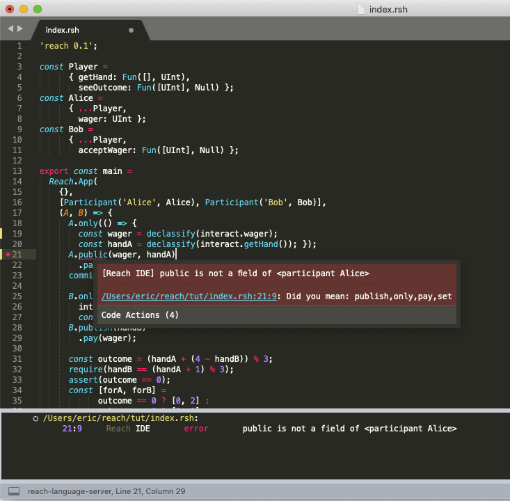

# Sublime Reach

Language Support for [Reach](https://reach.sh/) in Sublime Text.  

---

## Installation

1. Install the [LSP package](https://github.com/sublimelsp/LSP) for Sublime Text.

2. Install the [Reach IDE package](https://github.com/chrisnevers/reach-ide-sublime) for Sublime Text.

3. Download the latest reach-ls-*.zip file from https://github.com/ericglau/reach-ls/releases and unzip it.

4. In Sublime Text, go to the **Preferences** menu → **Package Settings** → **LSP** → **Settings**. This will open the LSP package settings.

5. In _LSP.sublime-settings — User_, add the configuration for the Reach language server:

```
// Settings in here override those in "LSP/LSP.sublime-settings"
{
  "clients": {
    "reach-language-server": {
      "enabled": true,
      "command": [
        "node",
        "/Users/eric/reach-ls-27d1fc1/out/server.js",
        "--stdio"
      ],
      "languageId": "Reach",
      "syntaxes": ["Packages/Reach IDE/Reach.sublime-syntax"],
      "scopes": ["source.rsh"],
    }
  },
  "log_debug": true,
  "log_stderr": true
}

```
6. Change _/Users/eric/reach-ls-27d1fc1/out/server.js_ to the real location of the `out/server.js` file in the directory that you unzipped to in step 3. It **must** be an absolute path.  
7. Restart Sublime.

---

## Usage

- Compile errors: automatically highlighted
- Quick Fix: hover over a compile error, click on Code Actions, and choose a suggested replacement
- Hover Definitions: put cursor over any Reach statement

